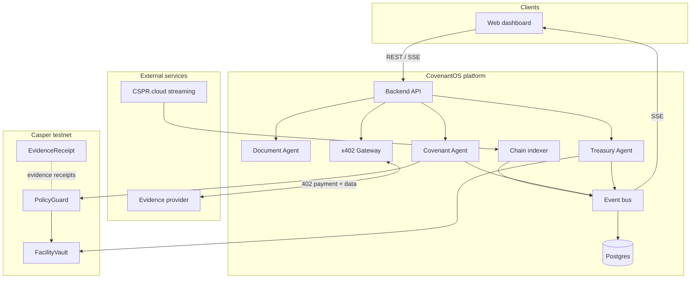

<div align="center">
  
  <br /><br /><br /><br /><br />
  <p>
    <strong><a href="https://covenantos.xyz">covenantos.xyz</a></strong> · agentic covenant monitoring and escrow orchestration for tokenized private credit and receivable-based assets on Casper Network.
  </p>
</div>

**CovenantOS** ingests facility agreements, extracts covenants, collects third-party evidence through x402 micropayments, evaluates compliance, and routes policy actions through on-chain multisig before treasury execution.

## Architecture



<br /><br /><br /><br /><br />

**Control flow.** Officers and agents interact with the backend API. The Document Agent extracts covenants from uploaded agreements. The x402 gateway pays the evidence provider for bank or ERP payloads; the Covenant Agent evaluates that evidence against registered covenants and proposes holds or releases through PolicyGuard. After multisig approval, the Treasury Agent executes vault operations. Local and on-chain events are persisted and streamed to the dashboard.

## Repository

| Package | Role |
|---|---|
| `contracts/` | Odra smart contracts — PolicyGuard, EvidenceReceipt, FacilityVault |
| `backend/` | Fastify orchestrator, agents, x402 gateway, indexer |
| `provider/` | x402 evidence API with on-chain payment verification |
| `shared/` | Shared types and testnet contract registry |
| `web/` | Next.js operations dashboard |

## Quick start

```bash
cp .env.example .env
npm install
npm run build -w @covenantos/shared
npm run dev              # backend :3001
npm run dev:provider     # provider :3002
npm run dev -w @covenantos/web   # dashboard :3000
```

Docker:

```bash
docker compose up --build
```

Reset demo fixtures:

```bash
npm run demo:reset -w backend
```

## Testnet deployments

Deployed on **Casper testnet** (`casper-test`). Explorer links are updated as new deploys and transactions are confirmed.

| Resource | Identifier | Explorer |
|---|---|---|
| Deployer account | `533109d2891f6c3a293be1bc88ad38965301dd8211b455e7850d1fc2268bce83` | [View account](https://testnet.cspr.live/account/533109d2891f6c3a293be1bc88ad38965301dd8211b455e7850d1fc2268bce83) |
| PolicyGuard | `hash-1c8d95efb3ee992910193a1cfbb5d168d13b1d92603a77f69c6555c9ab8fffa2` | [View package](https://testnet.cspr.live/contract-package-wasm/1c8d95efb3ee992910193a1cfbb5d168d13b1d92603a77f69c6555c9ab8fffa2) |
| EvidenceReceipt | `hash-8a42c4ae5401958ea19c5262bc81f9bfc171e3a6361aa4668f85eb8a615266c9` | [View package](https://testnet.cspr.live/contract-package-wasm/8a42c4ae5401958ea19c5262bc81f9bfc171e3a6361aa4668f85eb8a615266c9) |
| FacilityVault | `hash-ffe4bbfd8d1777649403c448ac46583cfd0ca70b836ebe885a87caa5a66d6910` | [View package](https://testnet.cspr.live/contract-package-wasm/ffe4bbfd8d1777649403c448ac46583cfd0ca70b836ebe885a87caa5a66d6910) |

> Transaction hashes for evidence recording, policy actions, and vault operations will be linked here as they are executed on testnet.

## Operations guide (live demo)

1. Open [covenantos.xyz/dashboard](https://covenantos.xyz/dashboard).
2. Click **Start live demo** (resets fixtures and opens Atlas Receivables).
3. Click **Run breach demo** — fetches x402 bank evidence, detects DSCR breach, proposes escrow hold.
4. Connect **CSPR.click** wallet → **Approvals** → **Approve with wallet**.
5. Confirm escrow **Held** on the facility page and txs in **Audit trail**.

For local development:

```bash
docker compose up --build
```

API alternative (step 3):

```bash
curl -X POST http://localhost:3001/facilities/fac-demo-002/check \
  -H 'Content-Type: application/json' \
  -d '{"scenario":"breach"}'
```

Document extraction: `POST /facilities/extract` (multipart upload; requires `ANTHROPIC_API_KEY`).

## Deploying contracts

Store the deployer key in `keys/deployer_secret_key.pem` or set `CASPER_SECRET_KEY_HEX` in `.env` (never commit secrets).

After pulling contract changes that add `demo_seed_balance`, redeploy so vault holds can execute on-chain:

```bash
npm run chain:wallet -w backend
cd contracts
env -u CARGO_TARGET_DIR cargo odra build
set -a && source ../.env && set +a
env -u CARGO_TARGET_DIR cargo run --bin covenantos_contracts_cli -- deploy --deploy-mode default
npm run chain:sync-deploy -w backend
```

Requires `binaryen` and `wabt` for Odra WASM builds. Set `CSPR_CLOUD_AUTH_TOKEN` to enable live contract-event indexing.

## API

| Method | Path | Description |
|---|---|---|
| GET | `/health` | Service health, database, indexer |
| GET | `/chain/status` | Wallet balance and contract registry |
| POST | `/facilities/extract` | Extract covenants from a document |
| POST | `/facilities/:id/check` | Fetch evidence and evaluate covenants |
| POST | `/facilities/:id/evidence` | Record x402 bank-statement evidence |
| GET | `/actions` | List proposed and executed actions |
| POST | `/actions/:id/approve` | Officer approval; treasury executes when threshold is met |
| GET | `/events/stream` | Server-sent events feed |
| GET | `/events` | Historical events from Postgres |
| POST | `/demo/reset` | Reset in-memory demo state |

## Security model

- **Runtime policy** — tool allowlist, counterparty allowlist, and spend caps on x402 and treasury operations
- **Evidence guard** — adversarial payload filtering before covenant evaluation
- **Evidence before action** — hold proposals require linked evidence; execution requires multisig approval
- **Log redaction** — secrets, payment headers, and raw evidence payloads are redacted in logs

## Stack

- Smart contracts: Rust, [Odra](https://odra.dev/)
- Backend: Node.js, TypeScript, Fastify
- Frontend: Next.js
- Chain: Casper testnet, casper-js-sdk, CSPR.cloud

## License

